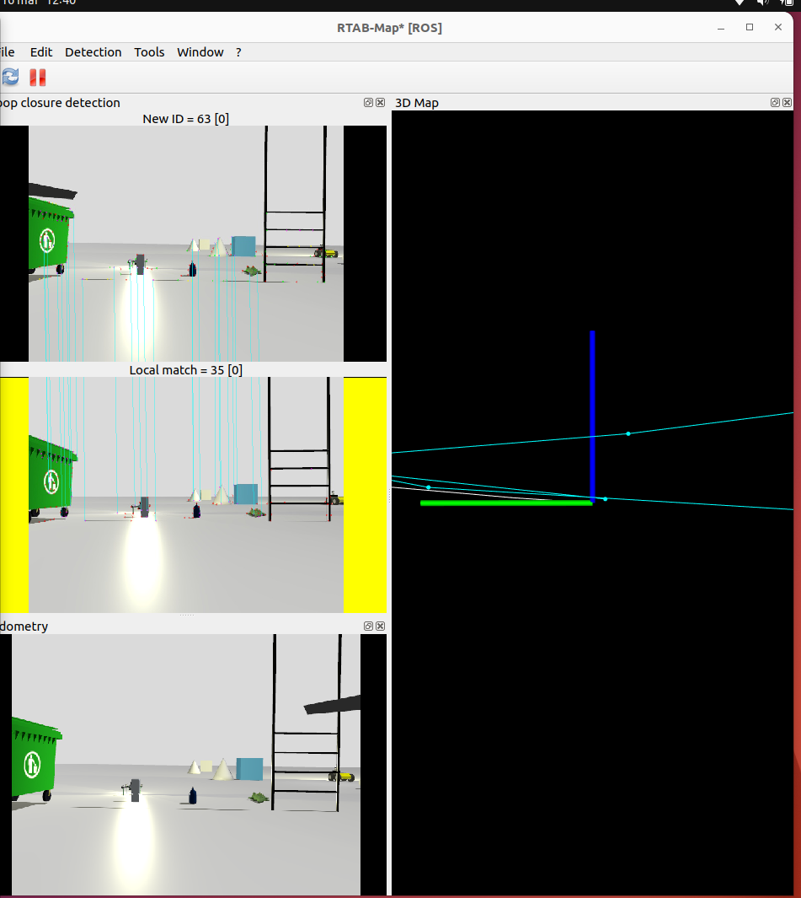
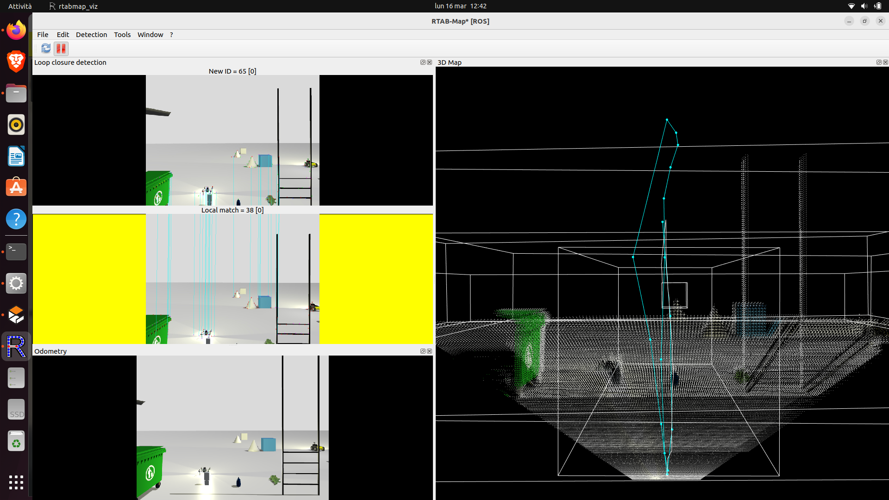
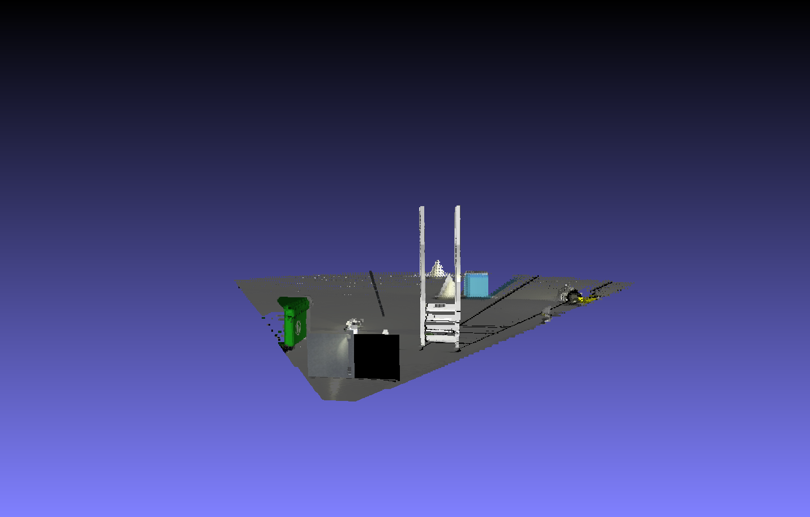

# Autonomous Drone Navigation with ROS2 and PX4

Project implementing autonomous drone navigation using:

- PX4 Autopilot
- Gazebo simulation
- ROS2 nodes in C++
- Offboard control

## Architecture

PX4 SITL → MicroXRCE-DDS → ROS2 nodes → Navigation logic

## Features

- Offboard control
- Autonomous waypoint navigation
- ROS2 C++ node controlling drone trajectory

## Technologies

- ROS2 Humble
- PX4
- Gazebo
- C++

## System Architecture

## Fase 1 demo

Nel video seguente viene mostrato un test completo del sistema in ambiente simulato. 

**Cosa dimostra il test:**
* Riconoscimento visivo del target a terra tramite la telecamera di bordo.
* Calcolo in tempo reale dell'errore di posizionamento (assi X e Y).
* Correzione autonoma della traiettoria del drone su Gazebo.
* Innesco della procedura di atterraggio di precisione (Precision Landing) una volta centrato il bersaglio.

*Clicca sull'immagine per guardare il video del test di atterraggio autonomo.*

## Fase 2: 3D Mapping e RGB-D SLAM

In questa fase, il drone è stato trasformato in un esploratore autonomo capace di ricostruire l'ambiente in 3D. 

### Setup dell'Ambiente
Per rendere il test significativo, l'ambiente Gazebo è stato arricchito con oggetti complessi (un cassonetto, una scala, modelli geometrici) per fornire alla telecamera sufficienti **visual features** per l'algoritmo di SLAM.

### Il Processo: Feature Matching & Odometria
Il cuore del sistema è **RTAB-Map**. Qui sotto puoi vedere come il drone "vede" il mondo: estrae punti chiave dagli oggetti (linee azzurre nel "Local Match") per calcolare il proprio spostamento senza l'uso del GPS.

*Riconoscimento delle feature visive sulla scala e sul cassonetto per il calcolo dell'odometria.*

### Risultati: Traiettoria e Nuvola di Punti
Dopo il volo, il drone ha generato una mappa densa dell'ambiente. La linea ciano rappresenta il percorso esatto seguito dal drone (Trajectory), mentre i punti ricostruiscono la geometria degli ostacoli.

*Visualizzazione della traiettoria di volo e della mappa 3D generata in tempo reale.*

### Risultato Finale (Point Cloud)
Ecco la ricostruzione finale esportata. Il drone ha creato un "gemello digitale" dell'ambiente di simulazione con precisione millimetrica.

*Nuvola di punti 3D densa dell'area di test.*

## Author

Alessia Aceti
