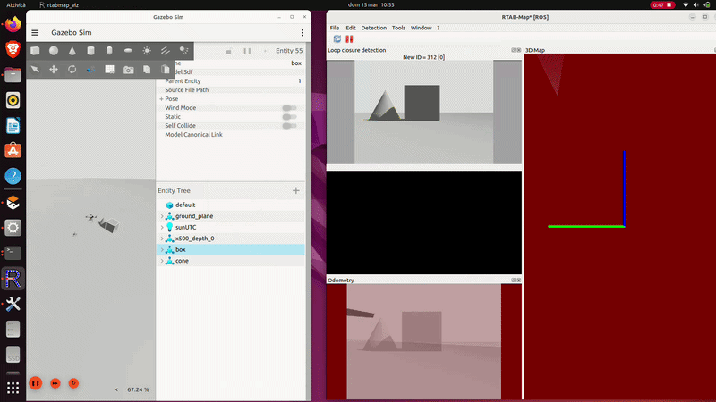
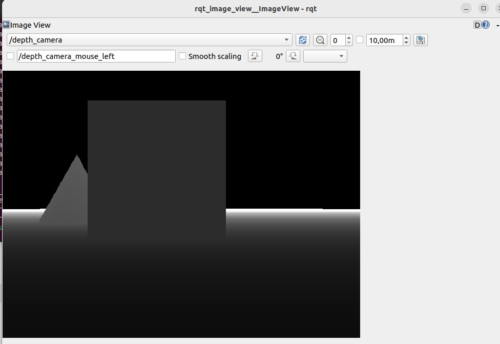
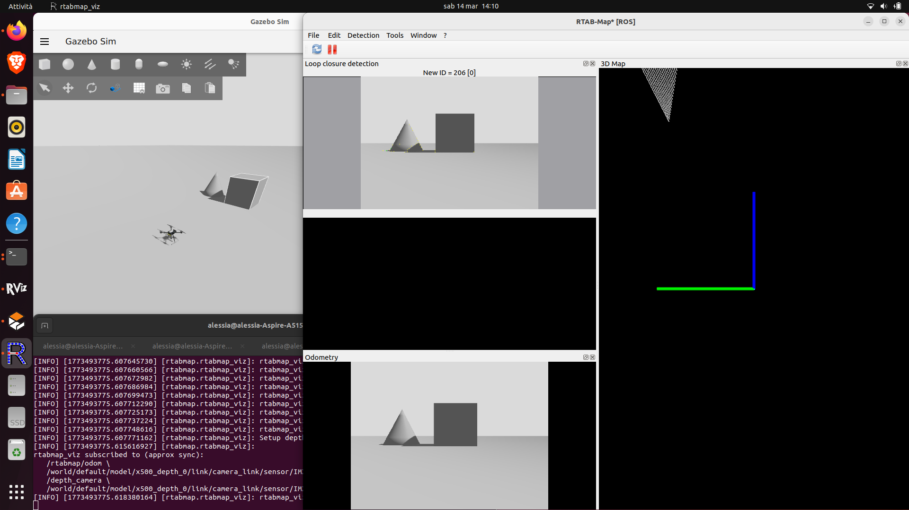
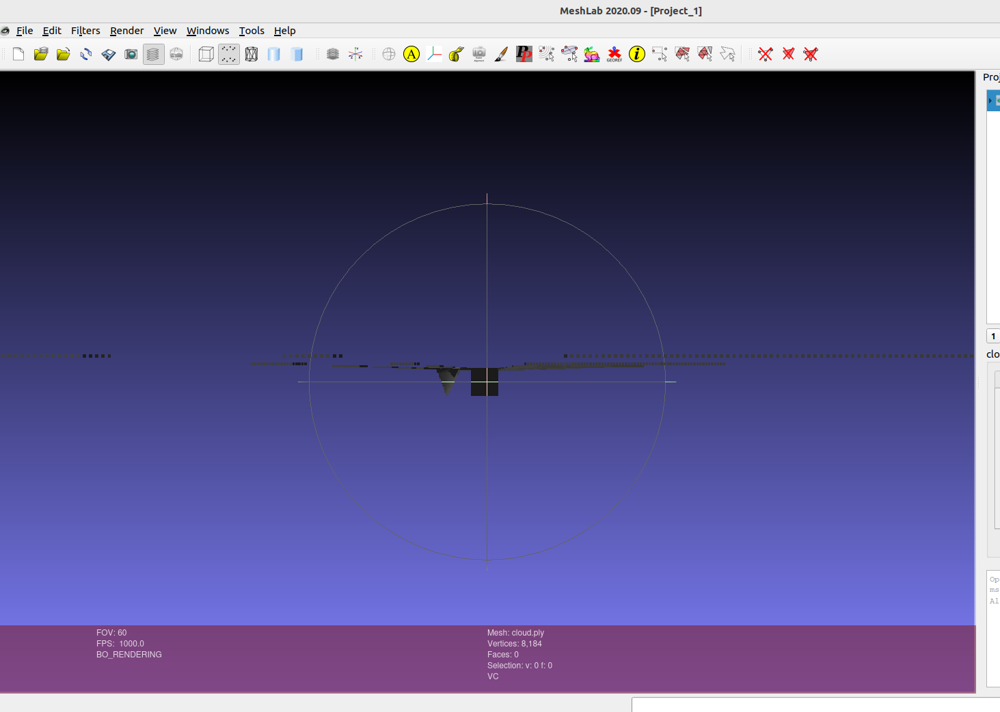

# Autonomous Drone Navigation with ROS2 and PX4

Project implementing autonomous drone navigation using:

- PX4 Autopilot
- Gazebo simulation
- ROS2 nodes in C++
- Offboard control

## Architecture

PX4 SITL → MicroXRCE-DDS → ROS2 nodes → Navigation logic

## Features

- Offboard control
- Autonomous waypoint navigation
- ROS2 C++ node controlling drone trajectory

## Technologies

- ROS2 Humble
- PX4
- Gazebo
- C++

## System Architecture

## Fase 1 demo

Nel video seguente viene mostrato un test completo del sistema in ambiente simulato. 

**Cosa dimostra il test:**
* Riconoscimento visivo del target a terra tramite la telecamera di bordo.
* Calcolo in tempo reale dell'errore di posizionamento (assi X e Y).
* Correzione autonoma della traiettoria del drone su Gazebo.
* Innesco della procedura di atterraggio di precisione (Precision Landing) una volta centrato il bersaglio.

*Clicca sull'immagine per guardare il video del test di atterraggio autonomo.*

## Fase 2: 3D Mapping e RGB-D SLAM
# Autonomous Drone Navigation & 3D Mapping

In questa fase del progetto, il drone è stato configurato per mappare un ambiente sconosciuto all'interno del simulatore **Gazebo**, utilizzando un approccio di tipo **RGB-D SLAM** (Simultaneous Localization and Mapping).

### Architettura e Strumenti
* **Sensori:** Il drone simulato (modello x500) è equipaggiato con una telecamera RGB (IMX214) e un sensore di profondità (Depth Camera).
* **Algoritmo SLAM:** È stato utilizzato il pacchetto **RTAB-Map** (Real-Time Appearance-Based Mapping) per ROS 2. RTAB-Map processa i topic `/image` e `/depth_camera` per calcolare la Visual Odometry (capire come si muove il drone nello spazio) e generare una mappa 3D dell'ambiente (Graph SLAM).
* **Integrazione:** La comunicazione tra il controllore di volo PX4, il simulatore Gazebo e i nodi ROS 2 di RTAB-Map è gestita tramite il *Micro XRCE-DDS Agent* e il *ROS Bridge*.

### Esecuzione
Durante la simulazione, il drone è stato pilotato manualmente (teleoperazione via QGroundControl) a bassa velocità attorno agli ostacoli. RTAB-Map ha elaborato i frame sincronizzati in tempo reale, estraendo le feature visive per la localizzazione ed espandendo progressivamente una *Dense Point Cloud* (Nuvola di Punti Densa).

### Risultati
L'ambiente simulato è stato scansionato con successo. Nella cartella `/results` è possibile trovare:
* `mappa.ply`: Il file contenente la nuvola di punti 3D esportata. Questo modello può essere visualizzato con software come MeshLab o CloudCompare.
* `screenshot_slam.png`: Immagini del processo di mapping in tempo reale tramite `rtabmap_viz`.

### Visualizzazione dei Sensori

### Processo di Mappatura (SLAM)

### Nuvola di Punti (Point Cloud 3D)

## Author

Alessia Aceti
