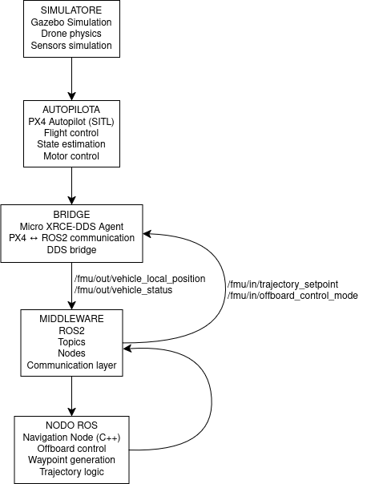

# Autonomous Drone Navigation with ROS2 and PX4

Project implementing autonomous drone navigation using:

- PX4 Autopilot
- Gazebo simulation
- ROS2 nodes in C++
- Offboard control

## Architecture

PX4 SITL → MicroXRCE-DDS → ROS2 nodes → Navigation logic

## Features

- Offboard control
- Autonomous waypoint navigation
- ROS2 C++ node controlling drone trajectory

## Technologies

- ROS2 Humble
- PX4
- Gazebo
- C++

## System Architecture

## Demo

*Clicca sull'immagine per guardare il video del test di atterraggio autonomo.*

## Author

Alessia Aceti
